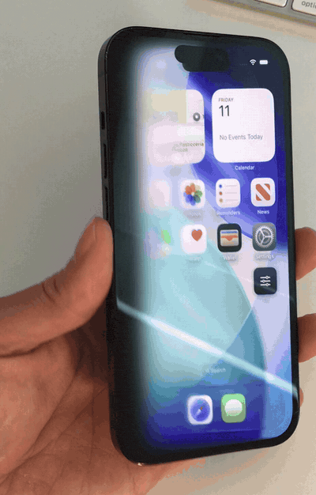

<div align="center">

# iPhone Solo

### Want that silky foldable page turn, but don't have the budget for a second screen?

Allow me to introduce **iPhone Solo**.

One display. Zero hinges. Infinite courage.

It gives any app that famously smooth unfold animation using hardware you already paid for in
2010: the gyroscope that has been sitting in your pocket doing nothing ever since.

Tilt the device. The screen pivots away from whichever edge is closest to the ground, softens,
and dissolves into the void. Tilt it back and everything reassembles from that edge outward.

No folding display required. No folding display supported, in fact.



**[Try it in your browser](https://peteropensource.github.io/iPhone-Solo/)** &nbsp;·&nbsp;
**[How it works](docs/ALGORITHM.md)** &nbsp;·&nbsp;
**[Port it yourself](docs/skill/SKILL.md)**

</div>

### Technical specifications

| | |
|---|---|
| **Display** | One. Uninterrupted. No crease, ever. |
| **Hinge** | None |
| **Durability** | Rated for 400,000 folds. Survived every one of them by not folding. |
| **Moving parts** | Also none |
| **Materials** | 100% recycled hype |
| **Availability** | Today, on the device currently in your hand |
| **Price** | $0 |
| **Second screen** | Still your problem |

---

Under the joke there is a real, tested library. It ships for SwiftUI, for the web and for
Jetpack Compose, it has a written specification you can port from, and it does not care what you
point it at.

## The idea

Don't think of it as a folding screen. Think of it like this:

> The content is a flat picture hanging in 3D space. The device is a window you look through.
> Tilting the device does not move the picture. It moves your eye.

Lying flat, you look at the picture head-on. Tilt, and it swings away from you around whichever
side edge is closest to the ground. That edge is the **root**: the hinge it pivots on, the last
place to blur, the first place to come back. Everything beyond the root recedes, goes out of
focus, and dissolves. At 90 degrees you are looking at it edge-on and it is gone.

The blur is doing the real work. Your eye accepts that something is receding when it also loses
focus, in the same direction, at the same rate.

## iOS and SwiftUI

Swift Package Manager. In Xcode, **File → Add Package Dependencies**, then:

```
https://github.com/peteropensource/iPhone-Solo.git
```

Or in a `Package.swift`:

```swift
dependencies: [
    .package(url: "https://github.com/peteropensource/iPhone-Solo.git", from: "1.0.0")
]
```

The module is called `TiltFold`, because `import iPhoneSolo` felt like pushing the joke one step
too far into your source file.

iOS 16+, macOS 13+, tvOS 16+. No dependencies. Built and tested against those three; other Apple
platforms are not claimed because they have not been checked. The gyroscope path is iOS only, and
everywhere else you drive the roll yourself.

### On any SwiftUI view

```swift
import TiltFold

ZStack {
    Color.black
    MyHomeScreen()
        .tiltFold()
}
.ignoresSafeArea()
```

That is the whole API for the common case. The content keeps working while it dissolves: lists
scroll, toggles toggle, animations animate. Layout is left alone, so the view takes exactly the
size it would have taken without the modifier.

The content dissolves into **transparency**, not into a colour, so whatever you put behind it is
what gets revealed. Put `Color.black` behind it to match the video.

### Driven by something other than gravity

```swift
MyCard()
    .tiltFold(roll: .degrees(dragOffset / 3))
```

Key it to a drag, a scroll offset, a page transition or an animation, and the same code becomes
a transition rather than an ambient effect. This is also how you get a stable result in previews,
tests and screenshots.

### On a still image, the fast path

`tiltFold()` renders its content once per blur level. When the content is a photo, a wallpaper or
album art, pre-render the ladder instead and pay nothing per frame:

```swift
@StateObject private var monitor = TiltMonitor()
@State private var picture: BlurredPicture?

var body: some View {
    ZStack {
        Color.black
        if let picture {
            TiltFoldPicture(picture, roll: monitor.roll)
        }
    }
    .task {
        picture = await BlurredPicture.make(named: "Wallpaper")
        monitor.start()
    }
}
```

This also gives a true Gaussian at every level and a properly feathered edge, so it is the
better-looking of the two paths as well as the cheaper one.

### Overlays that stay glued to the content

A button sitting on top of folded content would otherwise float there, sharp and opaque, while
everything behind it recedes. `tiltFoldOverlay` samples the dissolve at the overlay's own
position and applies the same blur, opacity and projection:

```swift
SettingsButton()
    .tiltFoldOverlay(roll: monitor.roll, at: UnitPoint(x: 0.84, y: 0.61))
```

It also stops accepting taps once it is more than half gone, so a nearly invisible control cannot
be hit by accident.

### Tuning

```swift
MyView().tiltFold(
    TiltFoldConfiguration(
        blackAt: .degrees(75),   // tilt at which the content is fully gone
        deadzone: .degrees(3),   // below this, nothing happens; hides sensor noise
        softness: 1.0,           // length of the dissolve front
        eyeDistance: 2.0,        // smaller means stronger perspective
        levels: 4,               // steps in the blur ladder
        omnidirectional: false   // let any edge or corner be the root
    )
)
```

`.subtle` and `.dramatic` are provided as starting points.

Only left/right tilt counts by default. Front-to-back pitch is deliberately ignored, because a
phone held in the hand is almost never at zero pitch and reacting to it makes the effect fire
constantly. `omnidirectional` opts in; it looks spectacular in a demo and is hard to hold still
in real life.

## Android and Jetpack Compose

`Android/` is a Gradle project with a `tiltfold` library module and a sample app.

```kotlin
val monitor = rememberTiltMonitor()

TiltFold(roll = monitor.roll) {
    MyScreen()
}
```

Built and run on an Android 14 emulator, with 22 unit tests asserting the same reference values
the Swift suite does. `Modifier.blur` needs API 31 for a real blur, so below that the library
keeps the fold and the dissolve and drops the progressive defocus rather than failing.
[Android/README.md](Android/README.md) has the details, including the two transform bugs that
every automated check passed straight through and only a screenshot caught.

## The web

`Web/` is an independent implementation with no dependencies, no build step and no framework. It
uses `DeviceOrientationEvent` on mobile and a drag on desktop, and it lets you drop in your own
image.

```bash
python3 -m http.server 8000 --directory Web
```

Then open `http://localhost:8000`. See [Web/README.md](Web/README.md).

## Porting it

[`docs/ALGORITHM.md`](docs/ALGORITHM.md) is the specification: the geometry, the two response
curves, the blur ladder, the edge-feathering trick that everyone gets wrong, and a table of
reference numbers you can check your port against. It has no Swift in it and assumes only that
you can rotate a texture in 3D and mask it with a gradient.

[`docs/skill/SKILL.md`](docs/skill/SKILL.md) is the same thing packaged as an agent skill. Drop
it into Claude Code or any agent that reads skills, point it at your framework, and it has what
it needs to write the port.

Flutter, React Native, Unity and WebGL are all wide open, and PRs are welcome.

## Examples

| | |
|---|---|
| [`Examples/iPhoneSolo`](Examples/iPhoneSolo) | The app from the video. A home-screen screenshot that folds, with the tuning panel hidden behind a fake home-screen icon. Uses `TiltFoldPicture` and `tiltFoldOverlay`. |
| [`Examples/LiveContent`](Examples/LiveContent) | `tiltFold()` on ordinary live SwiftUI content: a card with a picker, a toggle, a progress bar and a list, all still interactive while folded. Drag to drive it in the simulator. |
| [`Android/sample`](Android/sample) | The Compose equivalent. |
| [`Examples/Snippets.md`](Examples/Snippets.md) | Copy-paste recipes, including tilt as a gesture rather than as ambience. |

The two Xcode projects depend on the package by relative path, so you can open and run them
without touching anything.

## How it is tested

`Tests/` locks the Swift implementation to the specification. The reference values in section 10
of `ALGORITHM.md` are asserted directly, alongside the properties that matter: nothing dissolves
at rest, everything including the root dissolves at full tilt, the hinge does not move under the
projection, perspective is centred rather than hinged, pitch never leaks into roll, and the blur
ladder is monotonic and resolution-independent.

```bash
swift test
```

The web port's maths was checked against the same reference table. The Android port carries its
own 22 tests, run with `./gradlew :tiltfold:testDebugUnitTest`, plus `Android/verify-math.sh`,
which checks the arithmetic with nothing installed but `kotlinc`.

## What this is and is not

It is an effect, and a small one: a few hundred lines. It is a garnish on a screen, unless you
use tilt as an **input** rather than as decoration, in which case it becomes a gesture and starts
being interesting. Tilt to peek at the layer underneath, release to come back.

It cannot touch your home screen. iOS does not let third-party code replace the home screen,
there is no custom animated wallpaper API, and widgets cannot read the gyroscope in real time. On
iOS this lives inside your app or it does not live at all. Android is the permissive one here:
custom launchers and live wallpapers are both allowed, and nobody has built that yet.

## Licence

MIT, see [LICENSE](LICENSE). The bundled sample screenshot contains Apple artwork that is not
covered by it; see [NOTICE.md](NOTICE.md).

"iPhone" is a trademark of Apple Inc. This project is not affiliated with, endorsed by, or
sponsored by Apple, and the marketing department that named it does not exist.
